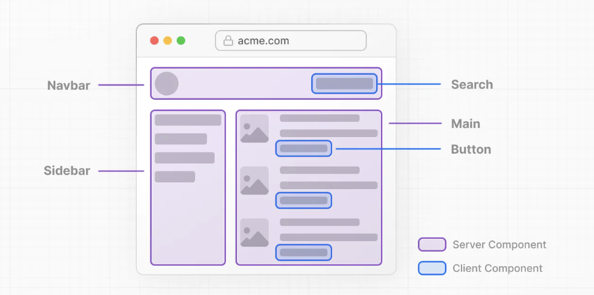

## Getting Started

First, run the development server:

```bash
npm run dev
# or
yarn dev
```

# Server and Client Components
````
 If we were to split the page into smaller components, you'll notice that the majority of components are non-interactive and can be rendered on the server as Server Components. For smaller pieces of interactive UI, we can sprinkle in Client Components
 ````


````
The use client directive is a convention to declare a boundary between a Server and Client Component module graph
````
````
'use client';
 
import { useState } from 'react';
 
export default function Counter() {
  const [count, setCount] = useState(0);
 
  return (
    <div>
      <p>You clicked {count} times</p>
      <button onClick={() => setCount(count + 1)}>Click me</button>
    </div>
  );
}
````